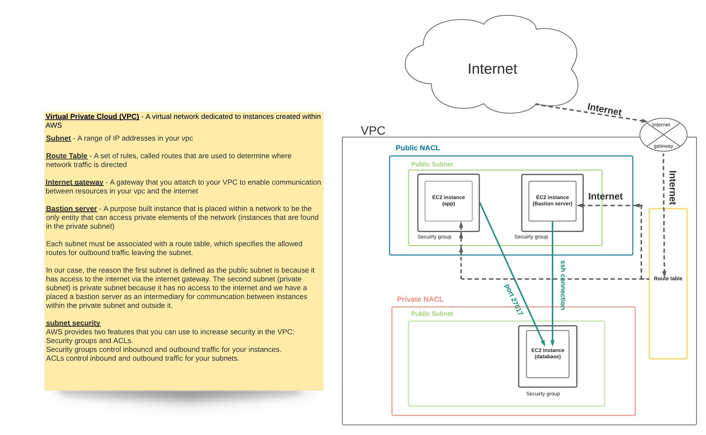

## VPC

- IGW
- Subnet
- NACLs
- Route Tables
- SG
- EC2

Objective :
- [x] Create a classical tier architecture VPC for our web app and DV
- [x] It will have a public subnet and private subnet
- [x] The above is N-tier practice
- [x] Getting it to work and communications & setting up all of the networing  will be the netowrk practice

## VPC
- Virtual private cloud in AWS to launch computing resources

## IGW
- Internet Gateway
- Attached to the VPC
- Allows internet into VPC via route table

## Subnets
- Internal Networking

## NACLs
- Network Access Control lists
- It's a firewall at the level of the subnet

## Route Tables
- Contains set of rules known as routes that are used to determine where network traffic from your subnet or gateway is directed

## EC2
- Elastic compute cloud
- It is a VM machine on cloud

## Security group
- It is a firewall - at the level of EC2 (instance)

Acceptance Criteria
- [x] has a private sub
- [x] has a public sub
- [x] is your own vpc
- [x] public sub has internet access
- [x] has the right routes
- [x] app exists in public sub
- [x] DB exists in private sub
- [x] Networking is done correctly

Summary
- create 2 subnets: public & private

- none of them will have internet until we create something known as internet gateway

- the route table will have a public(which will include the application) and private route (which will include the database)

- what will happen is that internet will travel into route table

- final objective is for us to deploy our app

- We will have security around the public subnet and the app & around the private subnet and DB

- public & private will be able to communicate with each other via the route table

1. We need an IP for VPC
2. We need IP for public subnet
3. We need UP for private subnet

## Step 1: Sign into Amazon Web Services
- Services --> VPC
- Choose Ireland location
- When choosing the area be aware it's not the same as availability zones
- Region = close cluster of data cantres
- Availability zones = within region= logically connected but physically segregated data centres inside a Region

## Step 2 : Create VPC
Your VPC- Create VPC

## Step 3: Create internet gateway
- > Internet gateway
- > Create
- > Give name

## Step 4: Attach internet gateway to VPC
- select the one just made

## Step 5: Create subnets
- > on the left menu go on subnets
- > create subnet

Creating public subnet

Creating private subnet

## Step 6: Create routes
- >Route table option from menu on the left
- > there is a default already in there

Add new one

- once created edit routes
- add 0.0.0.0/0

## Step 7 : Edit subnet associations
- click on public and save

(existing one gets automaticall associated to the main)

## Step: 7: Build some security

### Rules public

Ingress rules
- Allow port 80- for internet
- Allow port 443
- Allow port 22 on range of IPs
- Allow Ephemeral ports

Egress rules
- Allow all

### Rules for private
Ingress Rules

- Only allow inbound traffic from public subnet
- 27017 from (IP address chosen for private)

Egress rules
- Allow all to (chosen priate IP

## Step 8: Create Another ACL
- > Create network button
- > Add name and VPC just made
- > Inbound and outbound rules are now deny all and has no subnet associations.

## Step 9: Edit inbound rules

- rule #140 is bottom is my home IP and below is database IP

## Step 10: Edit outbound rules

## Step 11: Insert this security into my subnet

- > network ACLs
- > edit subnet associations & allow public

Now refresh and go on instances

## Step 12: Launch instance
- use our network just created

add tags

select key pair

## Step 13: ssh into the system on bash terminal

in terminal sudo apt-get install nginx

check the browser with the IP address from instance just created
